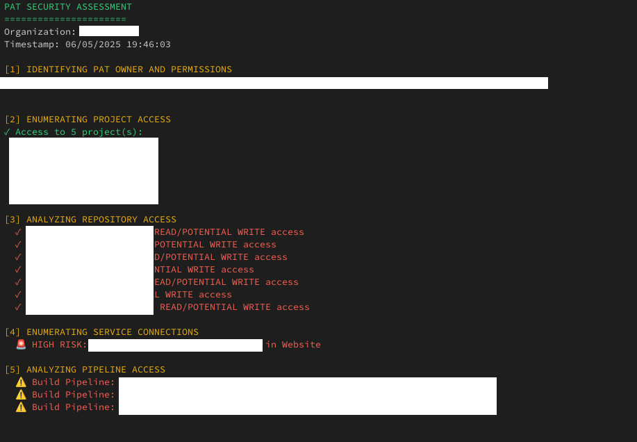

# PAT-Token-Checker
PAT Token Security Checker - A PowerShell script that analyses Azure DevOps Personal Access Token (PAT) to find its permissions, accessible resources, and security risks across projects, repos, pipelines, and secrets.



## What does it do? 

This script takes a Personal Access Token (PAT) and goes "hmm, what can this token actually access?". It's thorough and will check:

- **Who owns the PAT** - displays name and email 
- **Project access** - what projects can it see?
- **Repository permissions** - can it read/write to repos?
- **Service connections** - any cloud connections it can access? 
- **Pipeline access** - can it modify build/release pipelines?
- **Variable groups & secrets** - access to stored secrets 
- **User enumeration** - can it list other users?
- **Code scanning** - searches for hardcoded secrets in repos (limited to first 5 repositories when not targeting a specific project)
- **Build history** - access to build logs and artifacts (limited to first 3 projects when not targeting a specific project)

## Arguments 📝

```powershell
./Pat-TokenChecker.ps1 -PAT "your_token_here" -Organization "your_org_name"
```

**Required:**
- `-PAT` - The Personal Access Token you want to analyse
- `-Organization` - Your Azure DevOps organization name

**Optional:**
- `-Project` - Specific project to focus on (otherwise checks all accessible projects)
- `-OutputPath` - Where to save the reports (defaults to current directory)

## What you get 

The script generates two files:

1. **`PAT_Security_Assessment_[Org]_[Timestamp].json`** - All the technical details in JSON format
2. **`PAT_Summary_[Org]_[Timestamp].txt`** - A nice readable summary with high-risk findings

## Running it 🏃‍♀️

**On Windows:**
```powershell
.\Pat-TokenChecker.ps1 -PAT "your_token" -Organization "your_org"
```

**On Linux/Mac (with PowerShell installed):**
```bash
pwsh -File "./Pat-TokenChecker.ps1" -PAT "your_token" -Organization "your_org"
```

## Notes 💭

It's kinda scary how much a single PAT can do, so this script helps you understand the full scope of what someone with that token could access or modify.

Perfect for security assessments, incident response, or just satisfying your curiosity about what that random PAT in your config can actually do.

Remember to only run this on tokens you're authorised to test, and maybe don't share the output files around since they contain sensitive info about your Azure DevOps setup.

## Testing

Basic Pester tests are included to verify script behaviour. Run `Invoke-Pester` to execute the test suite.

